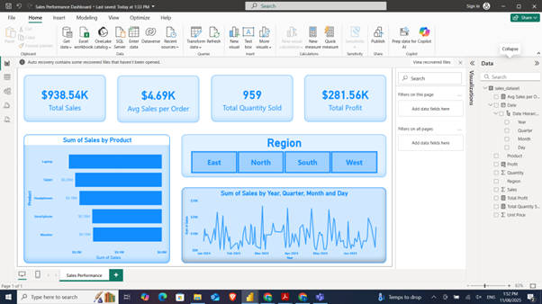
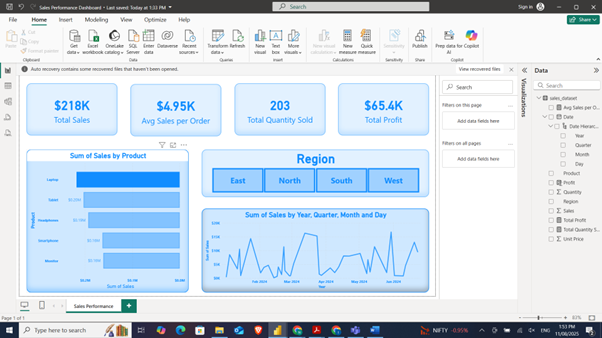
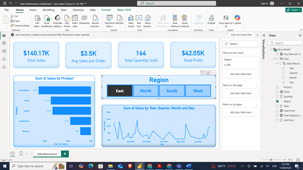
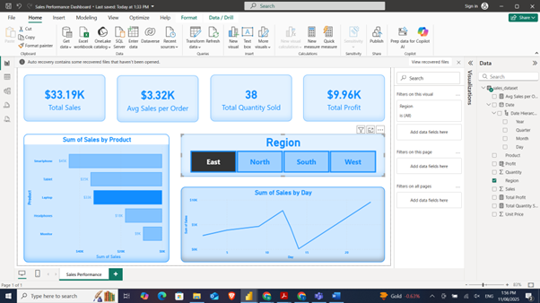
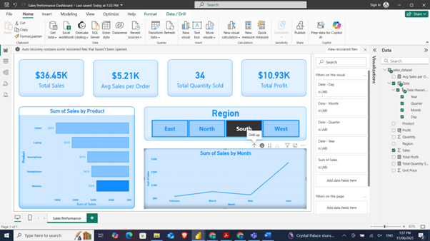
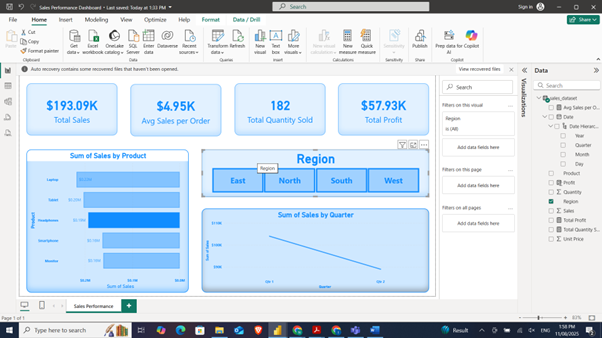

# Power BI Sales Performance Dashboard

## Overview  
This Power BI report provides an interactive Sales Performance Dashboard. It includes sales analysis by product, region, and time, with slicers and key performance indicators (KPIs) like total sales, average sales per order, and profit.

## Features  
- Data cleaning and transformation using Power Query  
- Interactive slicers for filtering by region and product  
- Visuals: bar charts, cards, and slicers  
- Measures for total sales, average sales, and profit  
- Basic formatting for readability and presentation  

## Screenshots  
Below are screenshots of the dashboard showcasing key visuals and interactions:

  
  
  
  
  
  

## How to Use  
1. Open `SalesDashboard.pbix` in Power BI Desktop (version 2.xx or later recommended)  
2. Explore the report pages and interact with slicers  
3. Modify or extend the report as needed  

## Skills Demonstrated  
- Power BI Desktop report creation  
- Data modeling and DAX measures  
- Data visualization and formatting  
- Interactive filtering and user experience design  

---

Feel free to customize the screenshot captions or order. Want help with anything else?
